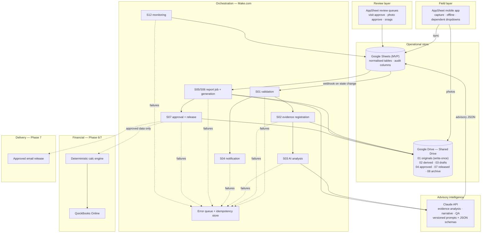

# Architecture Overview

**Document ID:** AH-SYS-P0-002 · **Revision:** 0 · **Status:** draft for owner approval

## 1. Principles

1. **One job per layer.** Capture, storage, orchestration, intelligence and accounting are separate. No layer reaches past its neighbour.
2. **IDs, not names.** Systems address each other by immutable IDs — `VisitID`, `PhotoID`, Drive file ID, QuickBooks customer ID. Never by filename, row number, folder path or display name (§4).
3. **State machines, not implied state.** Work advances only through declared transitions, each with a permitted actor role.
4. **Approval binds to content.** An approval records the exact `ContentHash` and `EntityVersion` it approved. Changed content voids the approval and every approval downstream of it.
5. **Determinism where it matters.** Money and quantities come from formulas. Language models write sentences, never numbers.
6. **Configuration over code.** Adding a project, location, activity, template or approval route is data entry.
7. **Safe by default.** Every irreversible action — send, post, share, delete — defaults to off, draft or sandbox until a specific approval exists.

## 2. Layer diagram



Dotted lines are Phase 6/7 paths, not built in the MVP.

## 3. Layer responsibilities and boundaries

### 3.1 AppSheet — capture and review
**Owns:** forms, dependent dropdowns, per-activity evidence rules, draft/submit separation, reviewer queues, operational dashboards, role-based views.
**Does not own:** trust. AppSheet security filters are the first line of enforcement; every state-changing automation re-validates authorisation server-side in Make (§7.4 — "do not implement authorization using UI visibility alone").
**Key constraint:** a webhook fires only after the device syncs. Offline submissions enter the pipeline late by design, not by fault.

### 3.2 Google Sheets — operational store (MVP)
**Owns:** all structured operational data. One row per entity. `UNIQUEID()` keys. `CreatedAt/By`, `UpdatedAt/By`, `IsActive` on every table.
**Deliberately temporary.** ADR-0002 records the migration trigger and keeps every access behind a defined table contract so a move to AppSheet Database or Cloud SQL is a swap of the store, not a rewrite of the system.
**Known limits:** no atomic increment (drives ADR-0005 numbering service); no transactions across tables; performance degrades as the Photos table grows (R-01).

### 3.3 Google Drive — evidence and document store
**Structure (§6):** `Al-Haram Operations/{ProjectCode}/{Year}/{Month}/` with `01_Original_Evidence`,
`02_Derived_Images`, `03_Draft_Reports`, `04_Approved_Reports`, `05_Completion_Certificates`,
`06_Invoice_Support`, `07_Released_Documents`, `08_Archive`.

**Rules:**
- Provisioning is idempotent: look up by parent + exact name before creating, and record the returned folder ID. Never create blind.
- `01_Original_Evidence` is **write-once**. No overwrite, resize, annotation, rotation or deletion. Derivatives go to `02_Derived_Images` with their own records (invariant I-2, operating rule 9).
- Never share `01_Original_Evidence`. Client-facing links, when they exist at all, point to released documents with least-privilege access.
- Files are addressed by Drive file ID, so an organisational move never breaks a reference.
- **Shared Drive, not My Drive** (ADR-0001): a personal My Drive dies with the account and takes the company's evidence archive with it.

### 3.4 Make.com — orchestration
Every cross-system action is a named scenario with: a correlation ID generated at entry; an
idempotency key checked against a Data Store before any side effect; an explicit error route; the
§12 failure classification; capped exponential backoff for retriable classes only; and a
dead-letter queue an operator can work from.

**Idempotency pattern (applies to every scenario that has a side effect):**
```
key = {ScenarioName}:{EntityType}:{EntityID}:{TargetState}
if store.exists(key) -> log "duplicate suppressed", stop
claim(key) -> perform side effect -> record result
on failure -> classify -> retry if retriable and under cap -> else dead-letter
```
This is what satisfies acceptance criterion 7 (duplicate triggers must not duplicate jobs).

### 3.5 Claude API — advisory intelligence
Two separated jobs, never merged into one prompt (§9):
- **Evidence analysis** (§9.1): describes what is visually supportable in one photograph. Returns schema-validated JSON. Never identifies people. Never estimates quantities, dates, compliance or completion. Flags caption contradictions.
- **Narrative and QA** (§9.2, §9.3): drafts report prose from structured approved records, then reviews the draft against those records and reports issues rather than silently rewriting.

**Hard boundaries:**
- Output is stored in dedicated advisory fields (`AIObservation`, `AIConfidence`, `AIAnalysisStatus`) and never written into an authoritative field.
- AI never sets `ApprovedForReport`, `PercentComplete`, any quantity, or any monetary value.
- All text arriving from images, captions, filenames and client documents is untrusted content, wrapped as data and never treated as instruction (§9.5).
- Prompts are versioned files in this repository; `PromptVersion` and `AIModel` are recorded on every DocumentJob so any output can be reproduced and explained.

### 3.6 Financial layer (Phase 6/7)
A deterministic calculation module — not a spreadsheet formula scattered across cells, and not a
model — computes line amounts, discounts, tax, retention, advance recovery and net payable, with a
stored calculation trace. QuickBooks receives only reconciled figures, only after finance approval,
and only through stored immutable QuickBooks IDs (never name matching, §8 Scenario 10).

## 4. The four invariants

| ID | Invariant | Enforced by |
|---|---|---|
| **I-1** | **Project segregation.** No user sees, and no process writes, data outside their assignments. | `ProjectID` on every row · `ProjectAssignments` · AppSheet security filters · server-side re-validation in Make · security tests in every phase gate. |
| **I-2** | **Evidence immutability.** The original file is never altered or removed. | Write-once folder · checksum recorded at registration and re-verified · derivatives isolated in a separate folder · no update/delete path exposed to any role. |
| **I-3** | **Approval binds to content.** An approval is valid only for the content hash it recorded. | `ContentHash` + `EntityVersion` on every Approvals row · recompute-and-compare before any release, post or send · changed hash voids the approval chain. |
| **I-4** | **Determinism of money.** No figure originates from a model. | Calculation module owns all arithmetic · AI prompts forbidden from emitting numbers · reconciliation against QuickBooks before marking synchronised. |

## 5. Trust boundaries

| Boundary | Threat | Control |
|---|---|---|
| Field device → AppSheet | Wrong project selected; stale or gallery photos passed as fresh | Assignment-filtered project list · capture timestamp and GPS recorded · old-photo warning without automatic rejection (§7.3) · reviewer decision is the real gate |
| AppSheet → Make webhook | Replayed or forged trigger | Re-read the authoritative record rather than trusting payload contents · idempotency key · shared secret held only in a Make connection |
| Photo / caption / client document → Claude | Prompt injection | Untrusted-content wrapping · instruction-ignoring system prompt · strict output schema · no tool access from the model · advisory-only storage |
| Claude → operational data | Fabricated facts or numbers | Schema validation · advisory fields only · human review before any document release · DATA GAP output required instead of guessing |
| System → client | Unapproved or wrong-recipient delivery | Release status required · recipient snapshot taken at release · idempotent single send · manual send throughout the MVP |
| Any layer → logs | Secret leakage | Sanitised request/response summaries only · secrets exclusively in Make connections and environment variables, never in Sheets, prompts, code or documentation (operating rule 4) |

## 6. Failure taxonomy and retry policy (§12)

| Class | Retriable | Policy |
|---|---|---|
| Validation | No | Record correctable errors, return to submitter. Never retry. |
| Authentication / Authorization | No | Alert administrator. Never retry. Possible security event. |
| RateLimit | Yes | Honour `Retry-After`; capped exponential backoff. |
| Network / ProviderUnavailable | Yes | Capped exponential backoff, then dead-letter. |
| FileMissing | Conditional | One delayed retry (sync latency is normal), then dead-letter. |
| SchemaMismatch | No | Dead-letter with the raw sanitised payload for diagnosis. |
| Duplicate | No | Suppress and log. Expected, not an error. |
| Conflict | No | Human resolution. Never auto-overwrite. |
| Unknown | No | Dead-letter immediately with full correlation context. |

Every alert carries: correlation ID · entity type and ID · scenario name · timestamp (UTC) ·
sanitised error summary · recommended operator action.

## 7. Deliberate architectural exclusions

- **No custom application server.** Every additional runtime is something the company must keep alive; the platform layers already provide execution, and the company has one technical decision-maker (R-07).
- **No AI in the approval path.** AI proposes; a named human disposes. This is what makes the audit trail defensible to a government client or an ISO auditor.
- **No public links to evidence.** Ever.
- **No WhatsApp automation.** Operating rules 12–13.
- **No shared user accounts.** They destroy attribution, and attribution is the point of the audit trail.
