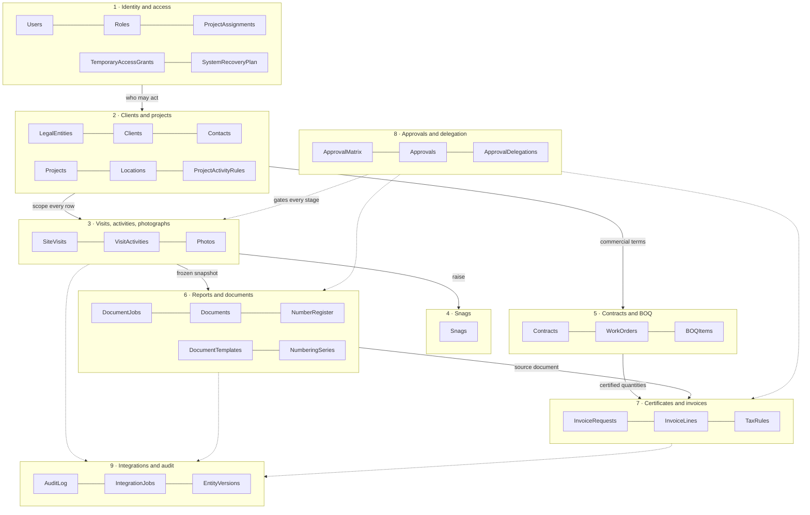
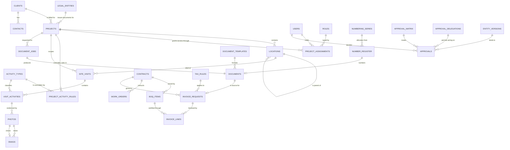
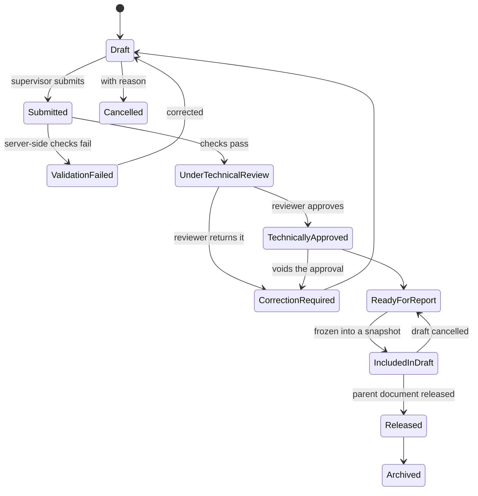
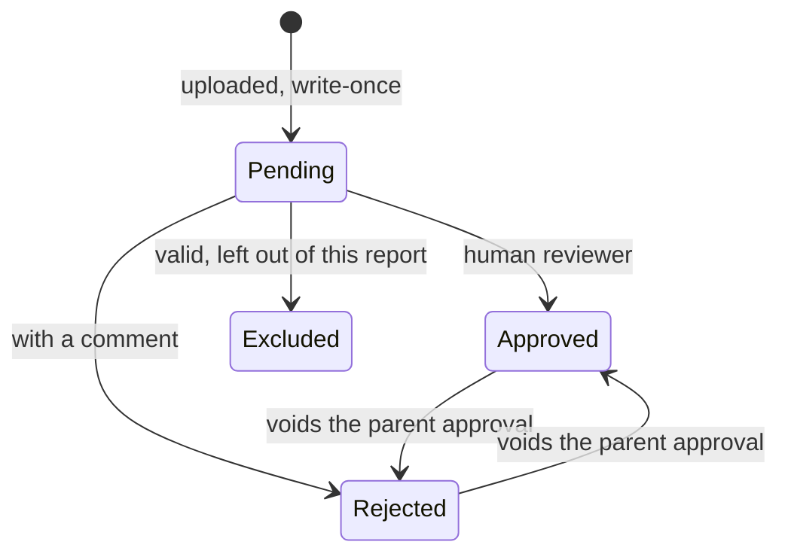
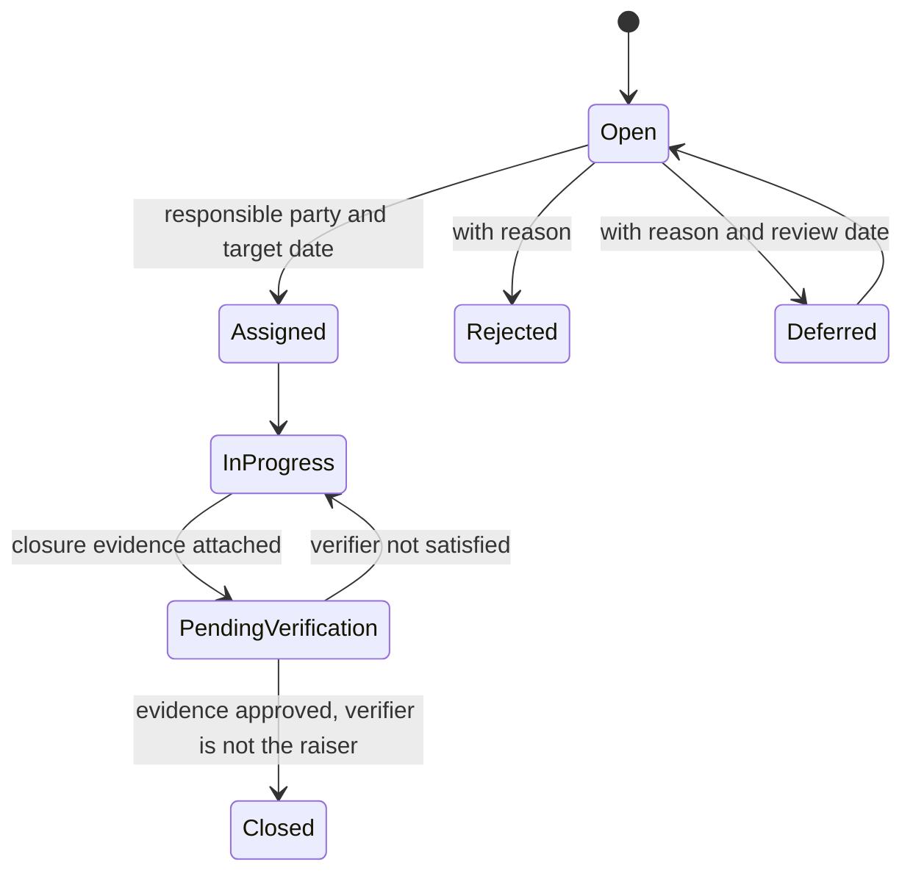
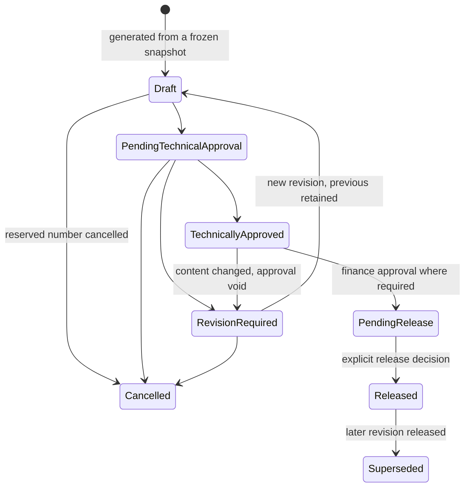
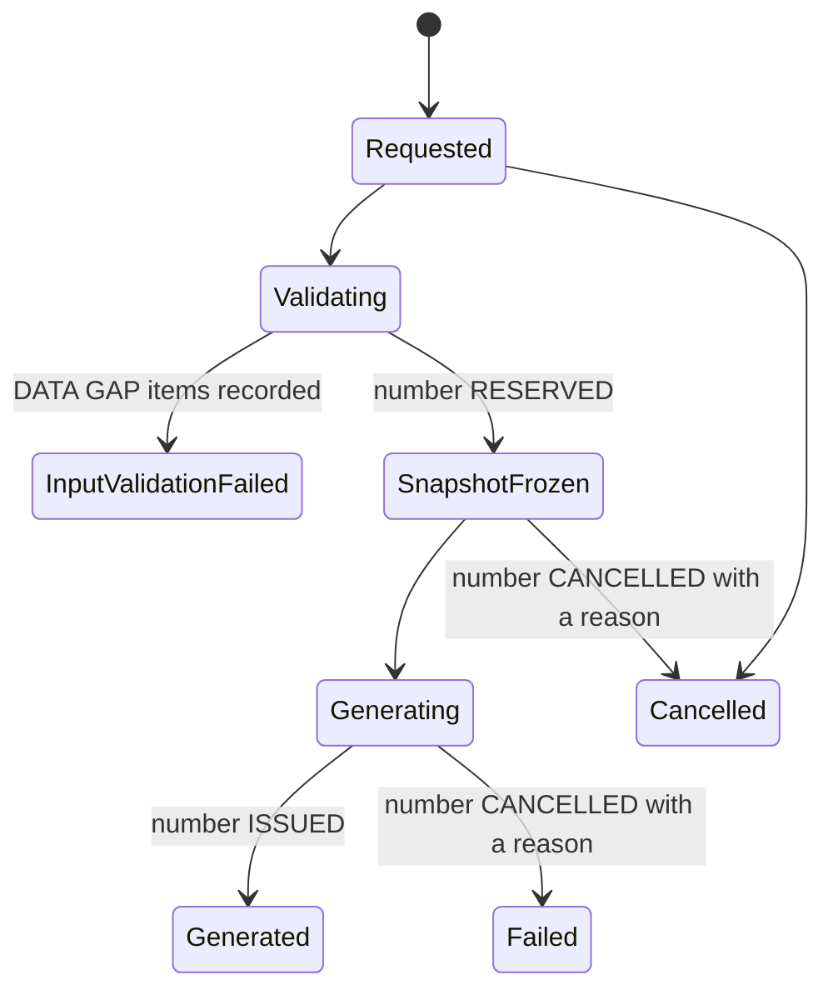
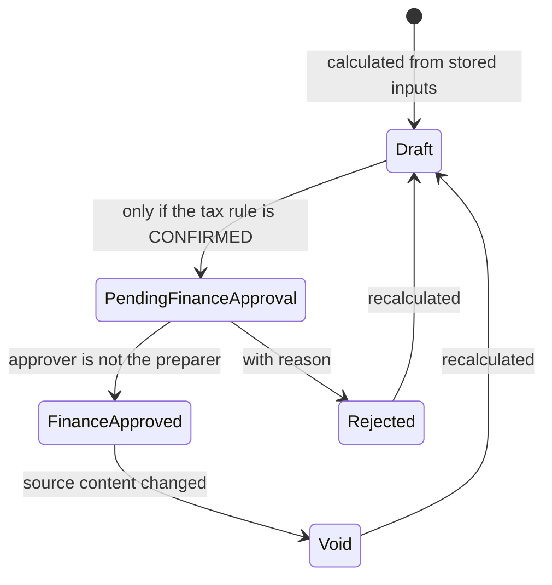
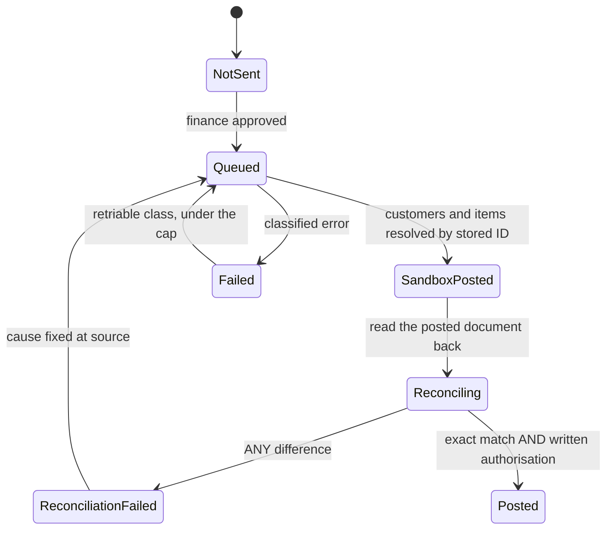
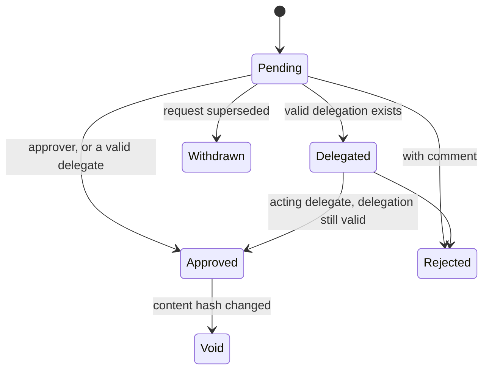

# Phase 1 — Owner Review Pack

**Document ID:** AH-SYS-REV-001 · **Revision:** 1 · **Date:** 2026-09-11
**Status:** Completed · Validated Locally · **Submitted for Owner Review**
**Purpose:** everything needed to approve, conditionally approve, or send back the Phase 1 design — without reading the repository.

**Reading time:** about 35 minutes. Every section links to the detailed file behind it, which you do
not need to open unless something here provokes a question.

| | |
|---|---|
| **What was built** | A complete data foundation: 46 tables, 829 columns, 11 status lifecycles, 10 roles, 460 access grants |
| **What was executed** | 172 automated checks, all passing, against synthetic data on a local machine |
| **What was connected** | **Nothing.** No Google account, no AppSheet app, no Make scenario, no Claude API call, no QuickBooks connection, no real data, no email |
| **Recommendation** | **Conditional approval** — see §14 |

---

## 1. Executive summary

Phase 1 turned the approved specification into a working *model* of the business: every table, every
field, every status transition, every access rule, every calculation, expressed once in a single
canonical file from which the schemas and the reference documents are generated. Nothing was built
that touches the outside world.

Four design choices carry the system, and each is now testable rather than aspirational:

1. **A project is configuration, not code.** Every behaviour that varies by project — locations, activity rules, evidence requirements, templates, numbering, approval route, reporting frequency, billing, language, residency — is a row in a table. Twelve automated checks confirm that no project, client or contract identifier appears anywhere in the logic, and that a fourth project added as data alone works immediately. The three test projects are fixtures; the platform's width is unbounded.
2. **Access is derived from assignment, never from a job title.** A user sees what their project assignments permit, and nothing else. An absent assignment grants nothing; an expired one grants nothing. Administrators — technical and business alike — administer the system without being able to read a client's evidence, documents or money.
3. **An approval is bound to the exact content approved.** Every approval records a fingerprint of the content. Change the content and the approval is void, along with everything downstream. This is what makes the audit trail defensible to a government client or an ISO auditor, rather than a list of claims.
4. **Money is arithmetic, never language.** Every figure that can reach a certificate or an invoice is produced by formula from stored inputs, with a stored trace. No monetary or measured figure ever originates from, or passes through, an AI model.

The fifth thing worth knowing is what the system refuses to do. An unconfirmed tax treatment does
not quietly become zero — it blocks. An unreviewed contract does not quietly permit an upload — it
blocks that project. A file is never called "the original camera image" until a real device proves
it. These refusals are the product.

**Detail:** [`docs/01-data-foundation/00-PHASE-1-SUMMARY.md`](01-data-foundation/00-PHASE-1-SUMMARY.md)

---

## 2. Entity relationship diagram

### 2.1 Domain map — how the nine areas connect



### 2.2 Core entities — the relationships that matter



Read the second diagram as three chains that meet: **assignment → project → evidence**,
**evidence → snapshot → document**, and **contract → certified quantity → invoice**. Approvals gate
each junction; the audit trail records every one.

---

## 3. The 46 tables, by business domain

Columns per table in brackets. "Built in" is the phase in which the table is *populated*; all 46 are
*designed* now, so nothing later is a migration.

### 1 · Identity and access — 7 tables
| Table | Cols | Purpose | Built in |
|---|---|---|---|
| `Users` | 15 | One row per person who may sign in. No shared accounts | 2 |
| `Roles` | 13 | The ten roles and what each may fundamentally do | 2 |
| `ProjectAssignments` | 14 | **The only source of row-level access.** Who may act on which project, in what role, between which dates | 2 |
| `TemporaryAccessGrants` | 26 | Time-bound auditor access and break-glass emergency access | 2 |
| `SystemRecoveryPlan` | 16 | How administrative control is recovered when no administrator is available | 2 |
| `ApprovalDelegations` | 17 | Temporary, bounded transfer of the right to act | 2 |
| `Languages` | 9 | Supported languages and text direction | 1 |

### 2 · Clients and projects — 9 tables
| Table | Cols | Purpose | Built in |
|---|---|---|---|
| `LegalEntities` | 29 | Registered entities that issue documents. Multi-entity from the start | 2 |
| `Clients` | 20 | Bilingual names, billing terms, classification, accounting identifier | 2 |
| `Contacts` | 16 | Who may receive a released document | 2 |
| `Projects` | 28 | **Every project-varying behaviour is a column here** | 2 |
| `Locations` | 17 | Hierarchical, project-scoped, up to five levels | 2 |
| `ActivityTypes` | 18 | The catalogue of 34 activities with default evidence rules | 1 |
| `ProjectActivityRules` | 16 | Per-project overrides of those rules | 2 |
| `Disciplines`, `Units` | 5, 6 | Controlled vocabularies | 1 |

### 3 · Visits, activities and photographs — 3 tables
| Table | Cols | Purpose | Built in |
|---|---|---|---|
| `SiteVisits` | 28 | One reporting event. The unit of submission and review | 2 |
| `VisitActivities` | 19 | What was done. Quantity, percent complete, supervisor confirmation | 2 |
| `Photos` | 45 | One photograph. Write-once original, advisory AI fields, reviewer decision | 2 |

### 4 · Snags and corrective actions — 1 table
| Table | Cols | Purpose | Built in |
|---|---|---|---|
| `Snags` | 24 | Raised from evidence, tracked to closure, closed only with evidence and a verifier | 2 |

### 5 · Contracts and BOQ — 3 tables
| Table | Cols | Purpose | Built in |
|---|---|---|---|
| `Contracts` | 23 | Terms, retention, advance, tax rule, billing method | 6 |
| `WorkOrders` | 13 | A discrete instruction under a contract | 6 |
| `BOQItems` | 20 | Quantities and rates, with cumulative certification control | 6 |

### 6 · Reports and documents — 5 tables
| Table | Cols | Purpose | Built in |
|---|---|---|---|
| `DocumentJobs` | 24 | A request to produce a document from a frozen snapshot | 5 |
| `Documents` | 25 | A produced revision, hash-bound and release-controlled | 5 |
| `DocumentTemplates` | 19 | Approved templates by type, language and project | 5 |
| `NumberingSeries` | 21 | One configurable series per entity × type × year × scope | 5 |
| `NumberRegister` | 18 | Every number reserved, issued or cancelled | 5 |

### 7 · Certificates and invoices — 3 tables
| Table | Cols | Purpose | Built in |
|---|---|---|---|
| `InvoiceRequests` | 30 | Calculated billing request with a stored calculation trace | 6 |
| `InvoiceLines` | 18 | Calculated lines. `LineAmount` is computed, never entered | 6 |
| `TaxRules` | 19 | Configurable, currently an explicitly unconfirmed placeholder | 6 |

*A completion certificate is a `Documents` row of type `CompletionCertificate`. It uses the same
engine, the same numbering service and the same approval model as a report — which is why adding a
document type is configuration rather than development.*

### 8 · Approvals and delegation — 3 tables
| Table | Cols | Purpose | Built in |
|---|---|---|---|
| `ApprovalMatrix` | 14 | Who approves what, per project and stage | 2 |
| `Approvals` | 23 | Every decision, bound to a content hash and a version | 2 |
| `EntityVersions` | 16 | Immutable version history of hashable records | 2 |

### 9 · Integrations and audit — 2 tables
| Table | Cols | Purpose | Built in |
|---|---|---|---|
| `AuditLog` | 13 | Append-only for every role, including administrators and break-glass | 2 |
| `IntegrationJobs` | 19 | One row per external call, with idempotency key and failure class | 3 |

### Designed now, populated later — 7 tables
`Materials`, `MaterialUsage`, `Equipment`, `VisitEquipment`, `Employees`, `VisitManpower`,
`DocumentTypes`, `DataClassifications`, `ResidencyRequirements`, `ResidencyAssignments`.

**Detail:** [`01-data-dictionary.md`](01-data-foundation/01-data-dictionary.md) — all 829 columns.

---

## 4. The fields and relationships that actually matter

Not all 829. These are the ones a decision depends on.

| Where | Field | Why it matters |
|---|---|---|
| Every project-scoped table | **`ProjectID`** | Carried on every row so access is decidable from the row alone. A reference to another project's row fails validation |
| `ProjectAssignments` | **`UserID` + `ProjectID` + `RoleID` + `AssignedFrom`/`AssignedTo`** | The whole access model. No row, no access. Expired row, no access |
| `Projects` | `ReportingFrequency`, `DefaultDocumentLanguage`, `BillingMethod`, `AIAnalysisEnabled`, `RetentionDays`, `LegalEntityID` | Each is a behaviour that would otherwise have been code |
| `ProjectActivityRules` | `RequiresBeforePhoto`, `RequiresAfterPhoto`, `RequiresQuantity`, `MinPhotos`, `IsPermitted` | Empty means "inherit the global rule". This is how one project demands three photographs and another two |
| `Photos` | **`OriginalFileKey`** | Write-once. Never overwritten, annotated, resized or deleted |
| `Photos` | `IsOriginalDeviceImageVerified` | Stays FALSE until a real device proves no re-encoding. Nothing may claim otherwise |
| `Photos` | `ReviewerDecision` / `ApprovedForReport` | Set by a human. AI may never write either |
| `Photos` | `AIObservation`, `AIConfidence` | Advisory, displayed separately, excluded from the content hash |
| `SiteVisits`, `Photos`, `Documents` | **`ContentHash` + `EntityVersion`** | What an approval is bound to |
| `Approvals` | `RequestedFromUserID` vs `DecisionByUserID` + `DelegationID` | Accountable approver and acting person recorded separately |
| `Approvals` | `IsOverride` + `OverrideReason` | A waived rule is recorded *as* a waiver. Silent override is the failure mode this prevents |
| `NumberRegister` | `State` + `CancellationReason` | Every gap in the numbering register is explainable |
| `TaxRules` | `ConfirmedByAccountant` + `TreatmentLabel` | FALSE blocks production invoicing. No classification may be named until confirmed |
| `InvoiceRequests` | `CalculationTrace` + `TaxRuleVersion` | Any figure can be re-derived and re-explained years later |
| `BOQItems` | `CumulativeQuantity` vs `ContractQuantity + ApprovedVariationQuantity` | The over-certification control |
| `TemporaryAccessGrants` | `Reason`, `ValidTo`, `NotificationSentAt`, `AuditReference` | All four mandatory for break-glass. Missing any one refuses the grant |

---

## 5. Status lifecycles

Eleven lifecycles are declared, with 82 permitted transitions and **36 explicitly forbidden**. The
forbidden list matters as much as the permitted one: a refusal on the record is a decision, not an
accident.

### 5.1 Site visit



**Forbidden:** Draft → TechnicallyApproved · Submitted → TechnicallyApproved · ValidationFailed →
UnderTechnicalReview · any transition by a user without an active assignment · approving your own
submission.

### 5.2 Photograph



**Forbidden:** any transition by AI or by automation acting on AI output · any transition that
modifies, replaces or deletes the original file · approval by the person who uploaded it.

### 5.3 Snag



**Forbidden:** Open → Closed · closure verified by the person who raised it.

### 5.4 Report (and every other document, including completion certificates)



**Forbidden:** Draft → Released · TechnicallyApproved → Released without a release decision ·
release to a contact not marked as an authorised recipient · editing a released document in place.

**Completion certificates** follow this same lifecycle, with two extra preconditions before
generation: the quantities must be technically approved, and the contractual references must resolve.
Nothing about completion dates or quantities is inferred.

### 5.5 Document job and number



A number moves **Reserved → Issued** or **Reserved → Cancelled**, and never back. A cancelled number
is never reused, so a gap in the register always has a recorded reason.

### 5.6 Invoice request — finance



**Forbidden:** Draft → FinanceApproved · any move to PendingFinanceApproval while the tax treatment
is `UNDETERMINED` · approval by the person who prepared it.

### 5.7 Accounting synchronisation



**Forbidden:** NotSent → Posted · posting while any figure differs · posting while production
posting is disabled · creating a customer or item by name matching.

### 5.8 Approval



**Forbidden:** approving your own restricted transaction because an approver is unavailable ·
approving with an expired, revoked or out-of-scope delegation · delegating to the originator ·
Void → Approved.

**Detail:** [`03-status-transition-matrix.md`](01-data-foundation/03-status-transition-matrix.md)

---

## 6. Role and permission matrix

Ten roles. `ALL` every row · `ASG` rows in assigned projects · `OWN` own rows · `—` no access at all.

| | Sys admin | Business admin | GM / owner | Technical reviewer | Finance reviewer | Project manager | Supervisor | Field user | Auditor | Break-glass |
|---|---|---|---|---|---|---|---|---|---|---|
| Technical configuration | **Write** | Read | Write | Read | Read | Read | Read | Read | Read* | **Write** |
| Business configuration | Read | **Write** | Write | Read | Read | Read | Read | Read | Read* | Read |
| Users and provisioning | **Write** | Read | Write | Read | Read | Read | Read | Own | Read* | **Write** |
| Clients and contacts | **—** | **Write** | Write | Read | Read | Read | ASG | — | Read* | **—** |
| Projects and assignments | Read + assign | **Write** | Write | ASG | Read | ASG | ASG | ASG | Read* | Read + assign |
| **Visits, activities, photographs** | **—** | **—** | ALL | ASG | ASG read | ASG | ASG / OWN | OWN | Read* | **—** |
| Snags | **—** | **—** | ALL | ASG | ASG read | ASG | ASG / OWN | OWN | Read* | **—** |
| **Reports and documents** | **—** | **—** | ALL | ASG read | ALL read | ASG | — | — | Read* | **—** |
| **Contracts, BOQ, invoices, tax** | **—** | **—** | ALL | **—** | **ALL** | **—** | **—** | **—** | Read* | **—** |
| Approvals | Read | — | Write | ASG write | Write | ASG write | — | — | Read* | Read |
| Audit log | Read | — | Read | — | Read | — | — | — | Read* | Read |
| Integration monitoring | **Read** | — | Read | — | Read | ASG read | — | — | Read* | Read |

`*` The auditor and break-glass columns apply **only while a valid, authorised, time-bound grant is
in force**. Without a grant, both roles read nothing at all.

**Four things this matrix says deliberately:**

1. **No one can delete anything.** Delete is denied to every role on every table. Rows are deactivated or cancelled; history is evidence.
2. **The audit log is append-only for everyone**, including both administrators and break-glass.
3. **Neither administrator can read evidence, documents or money.** A technical administrator configures and provisions; a business administrator maintains master data. Neither job requires a client's photographs, so neither can see them.
4. **Break-glass restores administration, not access to content.** It can reinstate an administrator and fix configuration. It cannot open a single photograph, document or invoice — because an administrative emergency is not solved by reading a client's evidence.

**Detail:** [`04-security-model.md`](01-data-foundation/04-security-model.md) — 460 grants, 20 stated exceptions.

---

## 7. Project segregation model

**The rule:** a user sees a row only if an active `ProjectAssignments` row links them to that row's
project. There is no second route — no job title, no default project, no view setting.

| Mechanism | Effect |
|---|---|
| `ProjectID` on every operational row | Access is decidable from the row itself, without a join a security filter cannot perform |
| Assignment dates | An assignment that has not started, or has ended, grants nothing |
| Denormalised project on children | An activity or photograph carries its project, so a child can never be reached through a parent in another project |
| Cross-project reference check | A foreign key pointing at another project's row fails validation |
| Server-side re-validation | Every state-changing automation re-reads the authoritative record and re-checks authorisation. The client's view of who may do what is irrelevant |

**What was tested (12 checks, all passing):** six user profiles across seven project-scoped tables
with no leak; an unassigned user reads nothing; an expired assignment grants nothing; a
multi-project user sees exactly two projects and no third; photographs never cross; no field role can
read any financial table; recipients resolve only to the project's own client; a project-specific
template is offered to no other project; a project-scoped numbering series is bound to its project;
no foreign key crosses; a location code reused across projects stays distinct; a residency
restriction disables AI for its own project only.

**What is not tested:** that AppSheet's security filters implement this rule. That is the Phase 2
gate, on the real platform, with a deep link and an API call attempted from an unassigned account.

---

## 8. Document numbering model

**One service, many configurable series.** A series is defined by legal entity × document type ×
year basis × scope × optional client requirement, each with its own format, padding, start number
and reset rule. Nothing is in code.

```
{ENTITY}-TR-{YYYY}-{NNN}     technical report          (illustrative)
{ENTITY}-QT-{YYYY}-{NNN}     quotation
{ENTITY}-CC-{YYYY}-{NNN}     completion certificate
{ENTITY}-{PROJECT}-TR-{YYYY}-{NNN}   a project-scoped run
```

**Lifecycle:** Reserved (atomically, when a snapshot freezes) → Issued (when the document is created)
or → Cancelled (with a mandatory reason). **A cancelled number is never reused.** Every gap in the
register is therefore explainable, which is the whole point in front of an auditor.

**Tested:** 200 concurrent reservations produced 200 distinct numbers with no collisions; a second
document type uses its own sequence; a project-scoped series is partitioned; a second legal entity
gets its own prefix and sequence; an issued number cannot be re-issued or cancelled; cancelling
without a reason is refused; reusing a cancelled value is refused; a series seeded with a last manual
number of 147 issues 148 next.

**Still required:** the existing manual register. Formats above are illustrative until it is
reviewed (**EF-08**), and no production number may be issued before then.

---

## 9. Approval, version and hash model

**The problem:** "approved" means nothing if the content can change afterwards. "Material change"
had to be defined, because hashing everything makes reviewers re-approve on every timestamp, and
hashing nothing makes the control theatre.

**The answer:** each record declares exactly which fields are material. The hash covers a canonical
serialisation of those fields — normalised text, fixed decimal scale, ISO dates, and the ordered set
of approved photographs folded in as child hashes.

| Included — it changes what the client sees | Excluded — it does not |
|---|---|
| Quantities, dates, times, descriptions in both languages | `UpdatedAt`, `UpdatedBy` |
| Captions, evidence stage, approval-for-report, report sequence | UI ordering, internal comments |
| Locations, activity types, supervisor confirmation | **Every advisory AI field** |

The last line is the one worth pausing on: **an AI observation arriving after a human approval can
never void that approval.** Assistance cannot overturn a person.

**On a mismatch:** the approval becomes `Void` with a reason, every downstream approval voids with
it, the document returns to `RevisionRequired`, and a new revision is created. Nothing is
overwritten; the superseded revision remains.

**Delegation:** bounded in time, stage and project; mandatory reason; never open-ended; revocation
recorded. A delegated decision records both the accountable approver and the acting person. No one
may approve their own restricted transaction because an approver is unavailable — the answer to an
absent approver is a recorded delegation, not a shortcut.

**Tested:** 14 hashing checks and 20 transition/delegation checks, including expired, revoked,
wrong-stage and wrong-project delegations, each refused for its own reason.

---

## 10. Deterministic financial calculation model

```
currency agreement → line amounts → subtotal → discount → taxable base
→ tax → retention → advance recovery → net payable
```

| Rule | Value |
|---|---|
| Storage | Decimal, never floating point |
| Rounding | ROUND_HALF_UP, money 2 dp, quantities 3 dp, applied at line level then on each total |
| Currency | Single, from the contract. **No conversion anywhere, no exchange rate stored** |
| Tax | **UNDETERMINED and blocked** while the accountant has not confirmed the treatment in writing |
| Over-certification | Rejected beyond contract + approved variation, unless an override records an approver **and** a reason |
| Trace | Every step and rounding decision stored, so any figure can be re-derived years later |
| AI | Never touches a number. It may draft the service description and the covering email, nothing else |

**The tax behaviour deserves a sentence of its own.** An unconfirmed rule does not quietly produce
zero. It produces `UNDETERMINED`, and the net payable is not computed at all. A draft can be
prepared and reviewed; it cannot be issued. "No tax configured" and "zero-rated" are different
statements, and the system refuses to conflate them.

**Tested:** 22 checks including zero, negative, decimal, over-contract, variation, retention, capped
advance recovery, discount exceeding subtotal, currency mismatch, half-up rounding at 0.125, and
byte-identical repeatability of the trace.

**Not tested:** reconciliation against QuickBooks. That cannot exist until Phase 7.

---

## 11. Bilingual and right-to-left model

**Delivered now:** every English text column has an Arabic counterpart, with no exceptions;
all 26 controlled vocabularies carry an Arabic label for every value; roles, units, disciplines, all
34 activities, document types and classifications are populated in Arabic; users carry an individual
language preference; text direction is stored as data; templates are keyed by type **and** language;
a project can be configured to produce Arabic documents; Arabic survives canonical serialisation and
hashing unchanged; Arabic-Indic digits are preserved.

**Two rules enforced, not merely stated:** an Arabic name is never written into an English column,
and a client may be registered *only* in Arabic. The second changed the model: a fixture client with
no English legal name could not be saved, so the requirement became "at least one legal name in
either language". Forcing an English name would have invited an invented transliteration that is not
the client's legal name.

**Deferred to Phase 5b:** authoring the Arabic template set, page-by-page RTL PDF inspection, Arabic
narrative generation. None of it requires a schema, workflow or interface change — which is the
point of doing the architecture now.

**Withdrawn:** the earlier claim that Arabic "roughly doubles the work". It applies to template
production, not to the system.

---

## 12. The five highest residual risks

| # | Risk | Why it is top-five | What reduces it | What you would see first |
|---|---|---|---|---|
| **1** | **Field adoption.** If supervisors find the app slower than sending photographs to a messaging group, evidence starves and everything downstream is worthless | This is the most likely cause of total failure, and it is not technical | Minimum fields, dependent dropdowns, choices over typing, offline capture. Measured with real supervisors at the Phase 2 gate as an acceptance criterion, not a training issue | Submissions per supervisor per week falling in month one |
| **2** | **Platform capability is unverified.** Security filters, webhooks and API access are all `UNVERIFIED`; any one missing at an economic tier breaks the pipeline | Three of sixteen requirements are pipeline-blocking, and official sources were unreachable from the build environment | The requirements matrix and a twenty-minute verification script (§5 of `12-…`). Verify **before** Phase 2 begins, not after | A tier that satisfies two of the three blocking requirements but not the third |
| **3** | **Image fidelity and offline behaviour are entirely untested.** Nothing is known about what the platform actually stores, or how it behaves offline on the company's phones | Touches the write-once evidence guarantee and the one workflow that cannot be retried — a supervisor who has left site | The approved D-13 wording claims only what can be defended. Real-device testing at the Phase 2 gate before any claim | A stored file materially smaller than the camera original |
| **4** | **Key-person concentration.** One general manager approves everything; administrator identities are still unassigned | The company's own assessment names reliance on the owner as a weakness. A system with one approver reproduces it | Delegation modelled and tested from day one; recovery plan with a go-live blocker; break-glass with reason, expiry, notification and audit | A month where approvals stall because one person is travelling |
| **5** | **Store ceiling as the estate grows.** The spreadsheet store has a practical limit, and the platform is sized for dozens-to-hundreds of projects | The photograph table grows fastest, and the volume assumption is an estimate, not a measurement | Five measurable migration signals defined; monitoring starts in Phase 2, before the threshold can be reached | Sync duration on a field phone creeping past fifteen seconds |

Risks 2 and 3 are the two you can retire cheaply and soon. Risk 1 cannot be retired by design at
all — only by watching real supervisors use it.

**Detail:** [`05-risk-and-controls-register.md`](00-discovery/05-risk-and-controls-register.md) — 32 risks.

---

## 13. Owner decisions still required

### Now — these gate Phase 2
| # | Decision | Why it cannot wait |
|---|---|---|
| **D-A** | **Approve, conditionally approve, or send back** the Phase 1 design (§14) | Nothing proceeds without it |
| **D-B** | **EF-03:** perform or delegate the twenty-minute platform verification | Three blocking requirements are unverified; the answer may change the capture layer |
| **D-C** | **EF-01:** name the owning Workspace account and the Shared Drive | First thing Phase 2 touches |
| **D-D** | **EF-06:** name a system administrator **and** a backup, or approve the documented recovery route instead | The go-live blocker stays set until one exists |
| **D-E** | **EF-05:** confirm the device inventory and which supervisors will take part in the field test | The field test is the Phase 2 gate |

### Soon — long lead times, other people must produce them
| # | Decision | Owner | Blocks |
|---|---|---|---|
| **D-F** | **EF-17:** written tax confirmation from the accountant | Accountant | Issue of any invoice |
| **D-G** | **EF-16:** contract review for residency and confidentiality clauses | You, from the contracts | Production upload of real data for affected projects |
| **D-H** | **EF-02:** verified legal identity from the current Commercial Registration | You | Issue of any production document |
| **D-I** | **EF-08:** the existing manual numbering register | You | Issue of any production number |

### Later — deferrable without cost
**EF-04** AI spend cap · **EF-07** named delegates · **EF-09** which clients require Arabic ·
**EF-10** orchestration organisation · **EF-11** alert recipients · **EF-12** retention and backup ·
**EF-13** working calendar and cut-off · **EF-14** gallery upload policy · **EF-15** logo and
client templates · **EF-18/19** contract and BOQ data · **EF-20/21** accounting inspection and
mappings · **EF-22** authorised recipients · **EF-23** written authorisation for production posting.

**Detail:** [`16-external-facts-register.md`](01-data-foundation/16-external-facts-register.md) — 23 facts, each with its blocking phase.

---

## 14. Recommendation

### **Conditional approval.**

**Approve** the Phase 1 data foundation — the model, the security design, the approval and hash
model, the numbering service, the calculation engine and the bilingual architecture. These are
internally consistent, executable, and tested to the limit of what can be tested without a platform.
Redesign is not warranted, and delaying approval does not make any of them more certain: the
remaining uncertainty is in the platforms, not the design.

**Conditional on four things**, in this order:

1. **Platform verification before Phase 2 begins (D-B).** Three of sixteen requirements are pipeline-blocking and unverified. If security filters, webhooks or the API are unavailable at an economic tier, the right response is to reconsider the capture layer — which is cheap now and expensive after an app exists.
2. **A recovery route before any go-live (D-D).** Either a second administrator or a documented, tested route. The system currently records this as an unresolved go-live blocker, which is where it should stay until you decide.
3. **Your review of three artifacts** — the data dictionary, the transition matrix and the security matrix. §6 above is the summary; the detail is where an error would hide. The exception most likely to provoke disagreement is that neither administrator can read evidence or documents at all.
4. **No Phase 2 external connection** until you say so in writing. Phase 2A — plan, workbook, expressions, security-filter specification, disabled blueprints, offline test plan — proceeds on synthetic data and connects nothing.

**Why not full approval:** because "Approved" should mean you have read the three artifacts in
point 3, and because the platform verification in point 1 could still change a structural decision.
Conditional approval lets Phase 2A proceed at no risk while both are resolved.

**Why not redesign:** nothing found in 172 checks suggests a structural fault. The three defects the
checks caught — two unreachable statuses, a project manager who could write the audit log, six
vocabularies without change attribution — were fixed as they were found, and a fourth correction
came from a fixture that refused to accept an Arabic-only client name.

### If you approve, the next deliverable is

Phase 2A: the AppSheet implementation workbook, column definitions and expressions, slices and
views, the security-filter specification, actions and workflow definitions, the offline test plan,
Drive folder-provisioning design, Make scenario specifications as disabled blueprints, deployment
and rollback checklists, and the cost and licensing matrix — all against synthetic data, connecting
nothing.

---

## Appendix — where everything lives

| Topic | File |
|---|---|
| What was executed, and what it does not prove | [`17-validation-evidence.md`](01-data-foundation/17-validation-evidence.md) |
| Every table and column | [`01-data-dictionary.md`](01-data-foundation/01-data-dictionary.md) |
| Every transition | [`03-status-transition-matrix.md`](01-data-foundation/03-status-transition-matrix.md) |
| Every access grant | [`04-security-model.md`](01-data-foundation/04-security-model.md) |
| Hashing and "material change" | [`02-key-id-and-hash-strategy.md`](01-data-foundation/02-key-id-and-hash-strategy.md) |
| Evidence rules | [`05-evidence-rules.md`](01-data-foundation/05-evidence-rules.md) |
| Numbering | [`06-naming-and-numbering.md`](01-data-foundation/06-naming-and-numbering.md) |
| Legal entity and bilingual | [`08-legal-entity-and-bilingual-model.md`](01-data-foundation/08-legal-entity-and-bilingual-model.md) |
| Residency and contract checklist | [`09-data-classification-and-residency.md`](01-data-foundation/09-data-classification-and-residency.md) |
| Approval and delegation | [`10-approval-and-delegation-model.md`](01-data-foundation/10-approval-and-delegation-model.md) |
| Financial calculation | [`11-deterministic-calculation-spec.md`](01-data-foundation/11-deterministic-calculation-spec.md) |
| Platform requirements matrix | [`12-appsheet-feature-to-plan-matrix.md`](01-data-foundation/12-appsheet-feature-to-plan-matrix.md) |
| Accounting mapping and inspection | [`13-quickbooks-mapping-and-inspection.md`](01-data-foundation/13-quickbooks-mapping-and-inspection.md) |
| User and device profiles | [`19-user-and-device-profiles.md`](01-data-foundation/19-user-and-device-profiles.md) |
| Outstanding external facts | [`16-external-facts-register.md`](01-data-foundation/16-external-facts-register.md) |
| Status vocabulary | [`STATUS-DEFINITIONS.md`](STATUS-DEFINITIONS.md) |
| Phase 2A plan | [`02a-plan/00-PHASE-2A-PLAN.md`](02a-plan/00-PHASE-2A-PLAN.md) |
